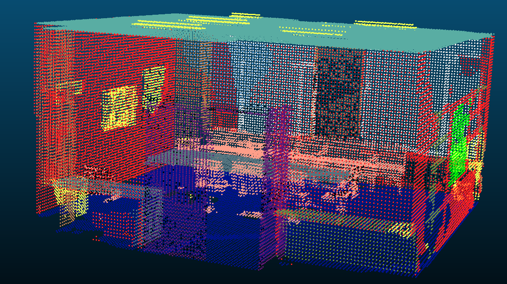
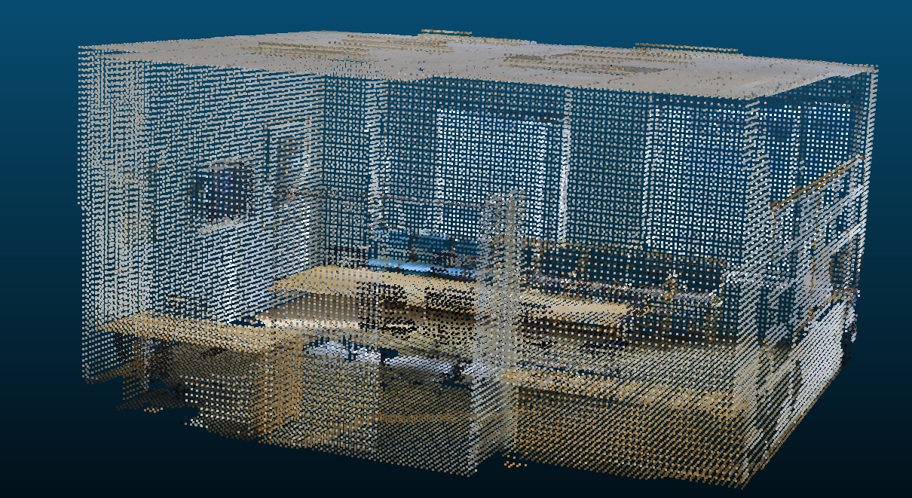

# Generalized Sparse Convolution
Exploring 3D understanding through Generalized Sparse Convolutions.

<table align="center">
  <tr>
    <td>
      <figure>
        
        <figcaption align="center">Prediction</figcaption>
      </figure>
    </td>
    <td>
      <figure>
        
        <figcaption align="center">RGB Ground Truth</figcaption>
      </figure>
    </td>
  </tr>
</table>

Segmentation of 3D-RGB point clouds using 3D Sparse Convolution on SIS3D dataset.

1. Clone the repo
```console
git clone https://github.com/matteo-st/4D-convnet
```

2. Set up virtual environment.
```console
./vm_setup/setup_minkowski.sh
```

3. Run training with a 3D UNet using sparse convolution.
```console
python ./scripts/train_stanford.sh
```
